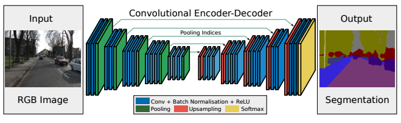

## SegNet

* original paper url : https://arxiv.org/abs/1511.00561

### Intro

SegNet is designed to be an efficient architecture for pixel-wise semantic segmentation.

Segmentation task 중에서 표현하고자 하는 class의 영역은 다양하다. 예를들어 road scenes data에서 대다수의 pixel 들은 도로 혹은 빌딩 같은 class
들을 나타낼 것이다. 따라서 모델은 해당 class에 대한 soft segmentation 을 잘 만들어 내야 한다. 반대로 모델은 작은 물체의 shape 또한 묘사할 수 있어야 한다. 
2015년 기준 SegNet 은 FCN의 영감을 받아 새로운 Architecture를 제안했다. 

모델은 Encoder 와 Decoder의 end-to-end 구조를 가지며 Encoder는 VGG16 model의 convolutional layer의 구조를 사용하고 Decoder는 
Encoder의 계층적구조를 따라가면서 Upsampling하는 구조를 가진다. 

SegNet의 구조는 매우 심플하면서 메모리의 효율성이 좋기 때문에 baseline 으로 많이 삼는 모델이다. 현재 많은 SoTA급 모델에 비해 coarse한 결과를 보이지만 자신이 만든 annotation의 적합성을 판단할 때 빠르게 확인할 수 있는 장점을 가진다.

### Usage 

* Loss 
    - implement dice loss
        - y_true shape : [ batch_size, image_h, image_w, 1 ]
        - y_pred shape : [ batch_size, image_h, image_w, classes ]
        
        
* Load Model

~~~
from model import *

model = SegNet(img_shape,  num_classes, use_bias=True, multi_class=True, summary=True)

# train
model.fit() 
~~~